Escuela Colombiana de Ingeniería

Arquitecturas de Software – ARSW
#### AUTORES:
- [Saray Mendivelso](https://github.com/saraygonm)
- [Milton Gutierrez](https://github.com/MiltonGutierrez)

####Taller – programación concurrente, condiciones de carrera y sincronización de hilos. EJERCICIO INDIVIDUAL O EN PAREJAS.

#####Parte I – Antes de terminar la clase.

Creación, puesta en marcha y coordinación de hilos.

1. Revise el programa “primos concurrentes” (en la carpeta parte1), dispuesto en el paquete edu.eci.arsw.primefinder. Este es un programa que calcula los números primos entre dos intervalos, distribuyendo la búsqueda de los mismos entre hilos independientes. Por ahora, tiene un único hilo de ejecución que busca los primos entre 0 y 30.000.000. Ejecútelo, abra el administrador de procesos del sistema operativo, y verifique cuantos núcleos son usados por el mismo.

   Para poder hacer la comparación de uso de los núcleos del procesador, tomamos captura del uso de los mismos antes de la ejecución del programa:
    

	   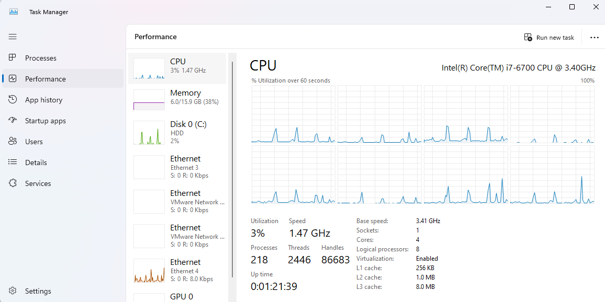
	

   Luego despues de la ejecución verificamos nuevamente la cantidad de uso de núcleos y vimos que se usan exhaustivamente 4 nucleos para poder procesar la ejecución del programa:
   

	   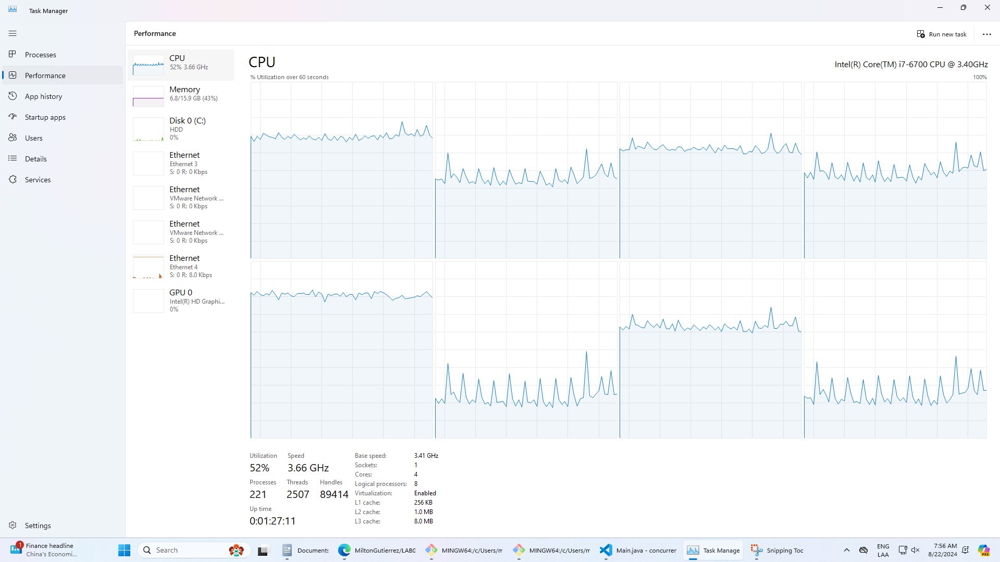
	

3. Modifique el programa para que, en lugar de resolver el problema con un solo hilo, lo haga con tres, donde cada uno de éstos hará la tarcera parte del problema original. Verifique nuevamente el funcionamiento, y nuevamente revise el uso de los núcleos del equipo.

   Para este punto simplemente se hizo la creación de otros 3 threads adicionales, a los cuales se les dividio la cantidad de trabajo como se muestra en la siguiente imagen.
       

	   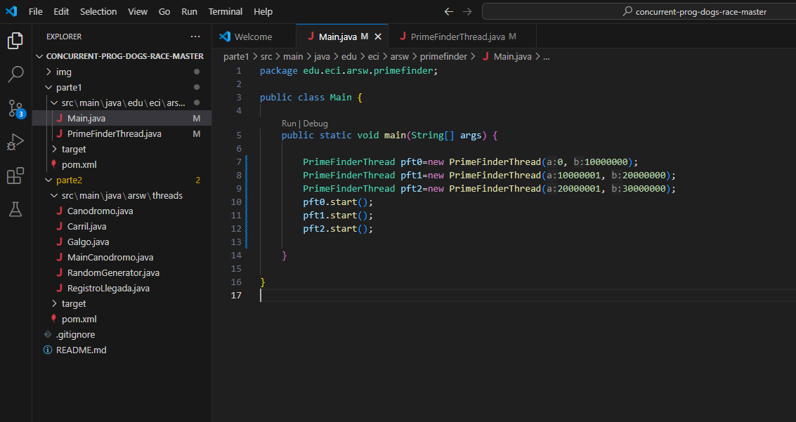
	

   Para poder hacer la comparación correctamente, se observara el uso de los núcleos antes y después de la ejecución del nuevo código:

   **ANTES**
      

	   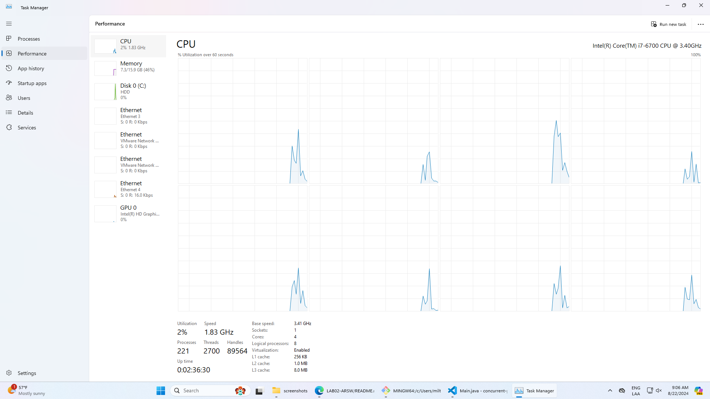
	

   **DESPUÉS**
      

	   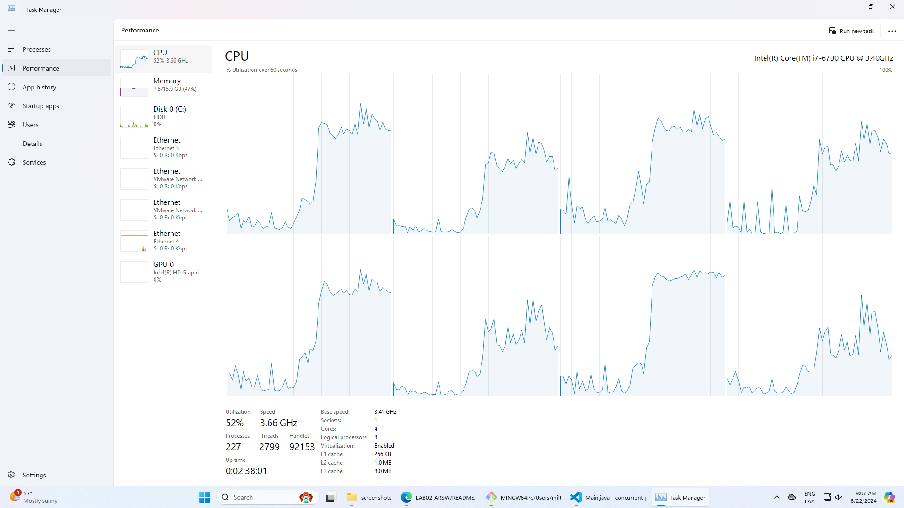
	

3. Lo que se le ha pedido es: debe modificar la aplicación de manera que cuando hayan transcurrido 5 segundos desde que se inició la ejecución, se detengan todos los hilos y se muestre el número de primos encontrados hasta el momento. Luego, se debe esperar a que el usuario presione ENTER para reanudar la ejecución de los mismo. 

   Para esto inicialmente guardamos los 3 PrimeFinderThreads en un arreglo, de tal manera que podamos acceder a ellos de manera más sencilla con el uso de For, iniciamos cada uno de los treads, y posteriormente a esto para poder controlar la ejecución de estos, utilizamos un ciclo que se ejecutara hasta que running sea false (running será true siempre que haya un thread vivo). Esperamos los 5 segundos de ejecución para con el ciclo For parar cada uno de los Threads con el método implementado *stopRunning*. Una vez parados, se contara los primos que se han encontrado hasta el momento.
      

	   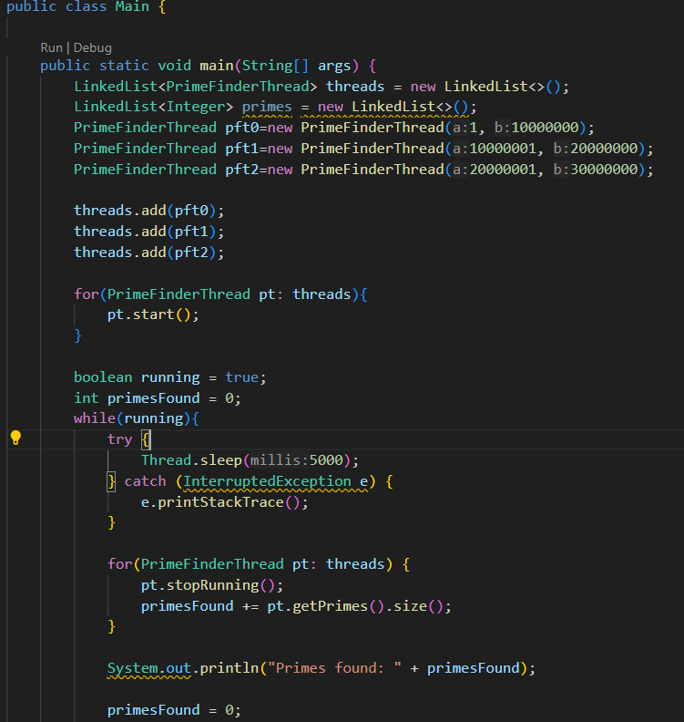
	

Para la continuación de la ejecución se pide que el usuario presione enter, se le asigna el valor de false a la variable running, si existe algún thread que siga vivo (no haya terminado su ejecución) se le dará el valor de true para que continue, esto con el método startRunning(). Finalmente cuando se termine la ejecución del ciclo en Main, se mostrará la cantidad final y total de primos encontrados.
      

	   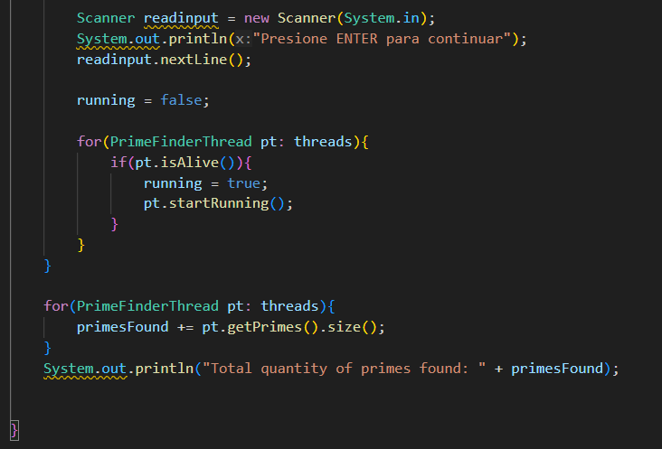
	

Ahora explicaremos como se implementaron los métodos, *run()*, *startRunnin()* y *stopRunning()* 

- **run()**
        

	   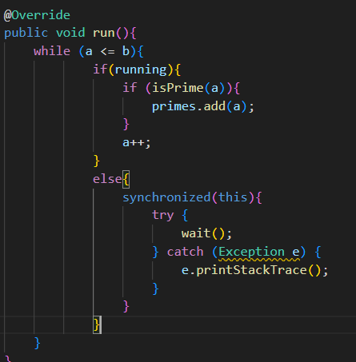
	

El ciclo se ejecutará hasta que se calcule todo el rango de números, si la variable booleana *running* es true (está es unica para cada thread), se hara el calculo de si es primo o no, de lo contrario, en un bloque sincronizado (utilizando el thread mismo como objeto) haremos que pare, esto hasta que el thread llame a notify como se mostrara en los siguiente metodos. 

- **startRunning()** y **stopRunning()**
        

	   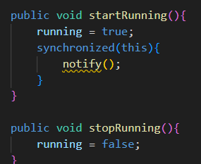
	

Como observamos el método *startRunning()* nos cambia la variable *running* a true, y además hace que el thread se llame a sí mismo para que continue con la ejecución, esto hara que continue buscando números primos, por el otro lado *stopRunning()* simplemente cambiará el valor de la variable *running* a false, de manera que cuando vuelva a ejecutar el ciclo en *run()*, el thread se pare a si mismo. 

 
#####Parte II 

Para este ejercicio se va a trabajar con un simulador de carreras de galgos (carpeta parte2), cuya representación gráfica corresponde a la siguiente figura:

En la simulación, todos los galgos tienen la misma velocidad (a nivel de programación), por lo que el galgo ganador será aquel que (por cuestiones del azar) haya sido más beneficiado por el *scheduling* del
procesador (es decir, al que más ciclos de CPU se le haya otorgado durante la carrera). El modelo de la aplicación es el siguiente:

Como se observa, los galgos son objetos ‘hilo’ (Thread), y el avance de los mismos es visualizado en la clase Canodromo, que es básicamente un formulario Swing. Todos los galgos (por defecto son 17 galgos corriendo en una pista de 100 metros) comparten el acceso a un objeto de tipo
RegistroLLegada. Cuando un galgo llega a la meta, accede al contador ubicado en dicho objeto (cuyo valor inicial es 1), y toma dicho valor como su posición de llegada, y luego lo incrementa en 1. El galgo que
logre tomar el ‘1’ será el ganador.

Al iniciar la aplicación, hay un primer error evidente: los resultados (total recorrido y número del galgo ganador) son mostrados antes de que finalice la carrera como tal. Sin embargo, es posible que una vez corregido esto, haya más inconsistencias causadas por la presencia de condiciones de carrera.

### Taller.

#### 1.  Corrija la aplicación para que el aviso de resultados se muestre sólo cuando la ejecución de todos los hilos ‘galgo’ haya finalizado. Para esto tenga en cuenta:

###### a.  La acción de iniciar la carrera y mostrar los resultados se realiza a partir de la línea 38 de MainCanodromo.

- Después de crear los hilos, el método `start()` se llama en cada objeto del galgo. Esto inicia la ejecución concurrente de cada hilo, es decir, comienza la carrera de cada galgo en paralelo.

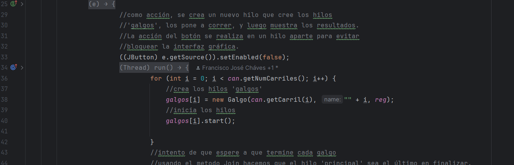

###### b.  Puede utilizarse el método join() de la clase Thread para sincronizar el hilo que inicia la carrera, con la finalización de los hilos de los galgos.
    
- Por medio del ciclo `for ` se logra recorrer todos los hilos de los galgos.
    

- `can.getNumCarriles()` nos suministra el numero de carriles en la carrera.
    

- Dentro del bucle, `galgos[i].join()` se asegura de que el hilo principal, es decir el primer hilo que comienza la carrera, espere hasta que cada hilo del carril termine su ejecución.

- Se incluye la excepción `System.out.println(ee.getMessage() ` en el caso de que el hilo que está esperando  es solicitado por otra parte del código, entonces se lanzará el mensaje de la excepción.
  

  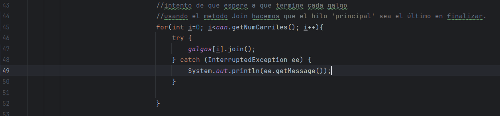
  

#### 2.  Una vez corregido el problema inicial, corra la aplicación varias veces, e identifique las inconsistencias en los resultados de las mismas viendo el ‘ranking’ mostrado en consola (algunas veces podrían salir resultados válidos, pero en otros se pueden presentar dichas inconsistencias). A partir de esto, identifique las regiones críticas () del programa.
1) Observamos algunas inconsistencias, como cuando varios galgos llegan simultáneamente a la primera posición, pero solo uno es mostrado como el ganador. Esto sugiere que puede haber problemas en la forma en que se determina y se muestra al galgo ganador, posiblemente debido a la falta de sincronización adecuada en la sección crítica.

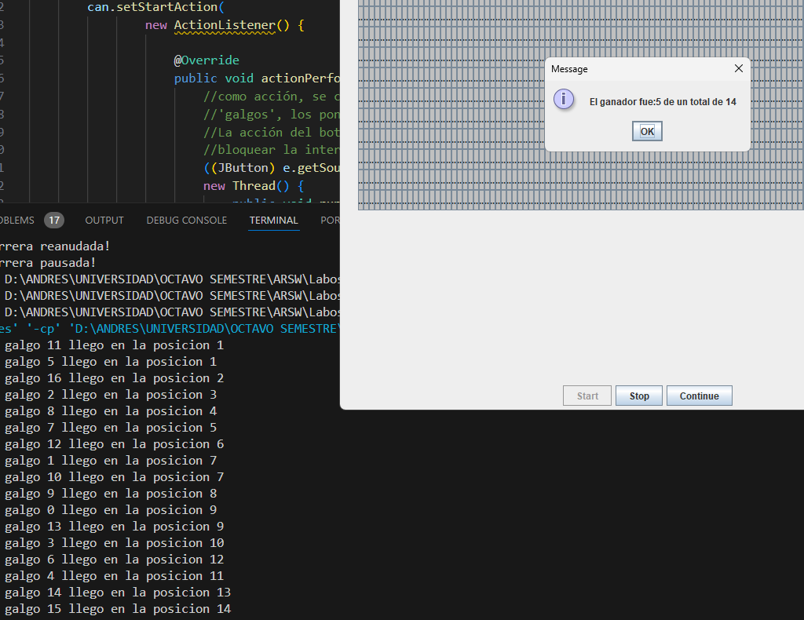

2)  Se observan múltiples llegadas en la misma posición (2), cuando en realidad se espera que cada hilo llegue a una posición distinta para evitar condiciones de carrera.

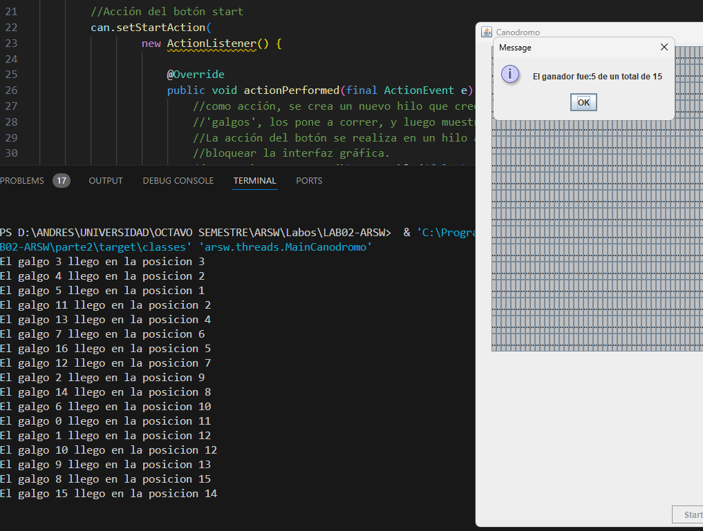

En consecuencia se identifican las siguientes regiones críticas, que son las funciones en donde el programa enfrenta conflictos al seleccionar al ganador y obtener la posicion de llegada (única).

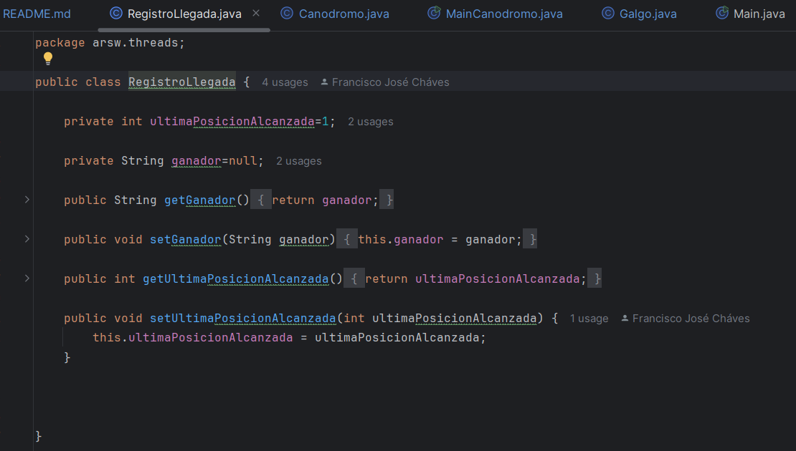

#### 3.  Utilice un mecanismo de sincronización para garantizar que a dichas regiones críticas sólo acceda un hilo a la vez. Verifique los resultados.

- La implementación del mecanismo  `synchronized(this)` en la sección crítica previene las condiciones de carrera asegurando que solo un hilo pueda acceder a esta región en un momento dado. 
solucionando el problema de las llegadas simultáneas en la misma posición 
y garantizando que la selección del ganador sea precisa y libre de interferencias concurrentes.

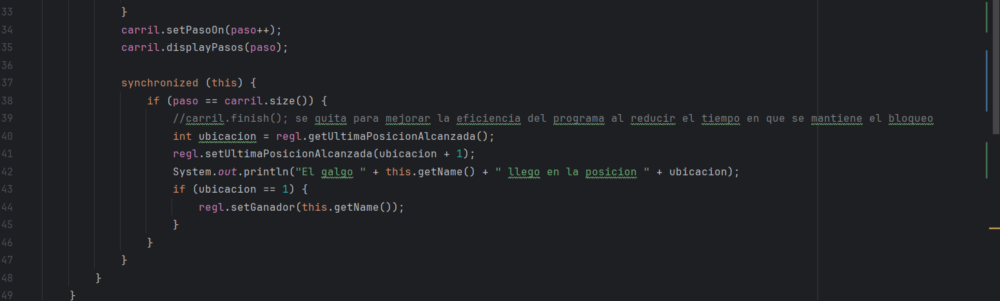

Con la implementacion anterior obtenemos la siguiente salida.

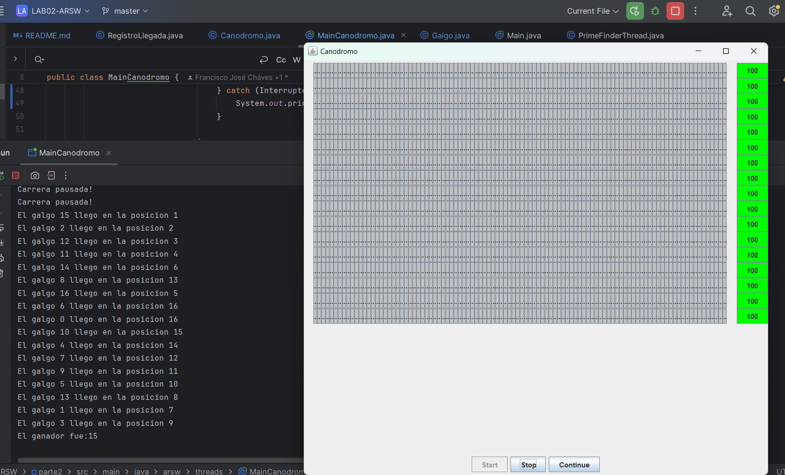

4.  Implemente las funcionalidades de pausa y continuar. Con estas,
    cuando se haga clic en ‘Stop’, todos los hilos de los galgos
    deberían dormirse, y cuando se haga clic en ‘Continue’ los mismos
    deberían despertarse y continuar con la carrera. Diseñe una solución que permita hacer esto utilizando los mecanismos de sincronización con las primitivas de los Locks provistos por el lenguaje (wait y notifyAll).

- Se deben usar las funciones de espera `wait` y `notifyAll.` 
En la implementación, cuando se hace clic en el botón 'Stop', el método asociado 
con el evento de clic en `can.setStopAction` pausa todos los hilos de los 
galgos. Esto se logra bloqueando el objeto `reg` y llamando al método
  `stop(true)` en cada hilo Galgo, lo que hace que cada hilo entre en un 
estado de espera. Durante este estado, los hilos se detendrán y no 
continuarán su ejecución hasta que se les indique lo contrario.

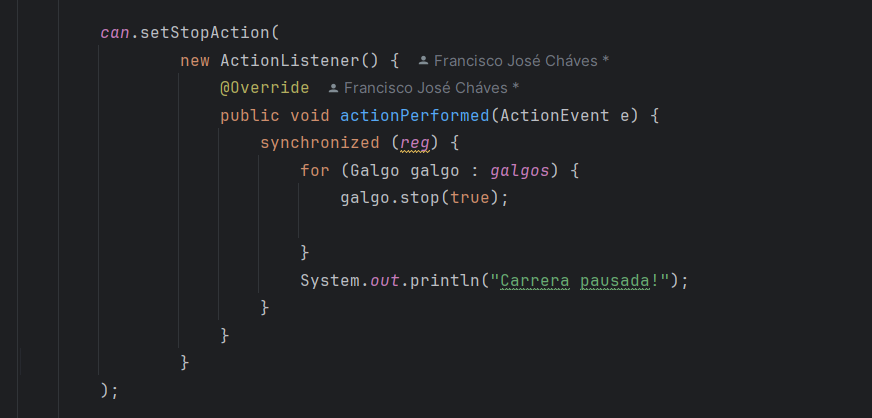

- Por otro lado, al hacer clic en el botón 'Continue', el método asociado
con `can.setContinueAction` reanuda la ejecución de los hilos. 
Se bloquea el objeto `reg` y se llama al método `stop(false)` en cada 
hilo, indicando que los hilos deben continuar su ejecución. Luego, se 
llama a `notifyAll()` en el objeto reg para despertar a todos los 
hilos que estaban esperando. Esto permite que los hilos se reanuden y 
continúen la carrera desde donde se detuvieron.

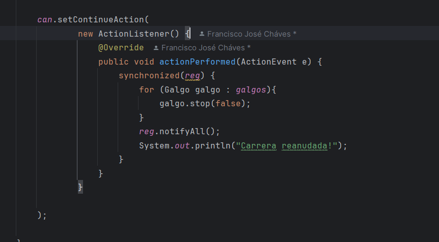

Logrando asi pausar y continuar de una manera eficiente según lo explicado anteriormente.

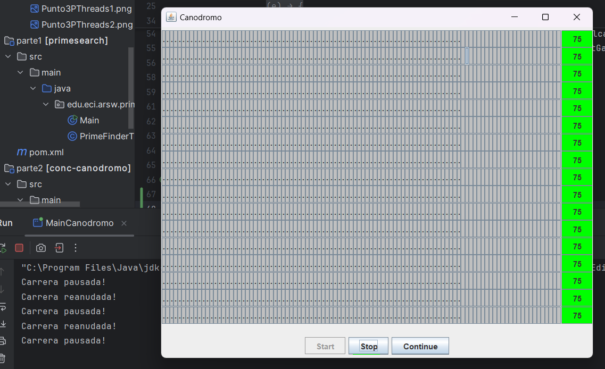

## Criterios de evaluación

1. Funcionalidad.

    1.1. La ejecución de los galgos puede ser detenida y resumida consistentemente.
    
    1.2. No hay inconsistencias en el orden de llegada registrado.
    
2. Diseño.   

    2.1. Se hace una sincronización de sólo la región crítica (sincronizar, por ejemplo, todo un método, bloquearía más de lo necesario).
    
    2.2. Los galgos, cuando están suspendidos, son reactivados son sólo un llamado (usando un monitor común).

